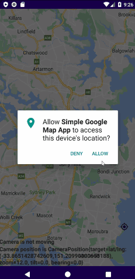

# Simple Google Map App - Jetpack Compose

This app shows how to implement simple Google map using the Google map compose library.

## Requirements
- Android Studio Chipmunk or later

## Tech Stack
- Jetpack Compose
- Goole Map Compose Library
- Secret Gradle Plugin
- Permission Request
- Location Setting Request

## Articles
- Simple Google Map App - Jetpack Compose
